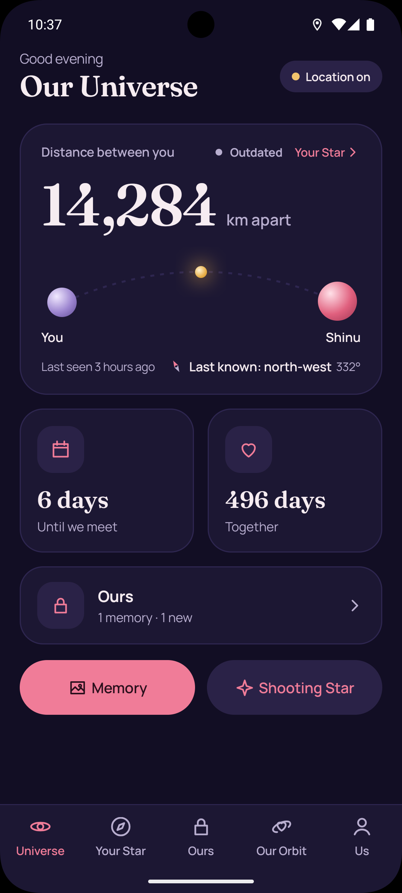
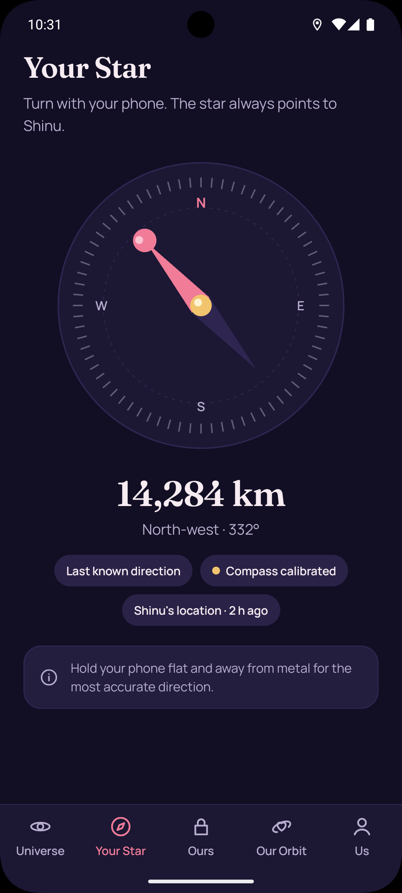
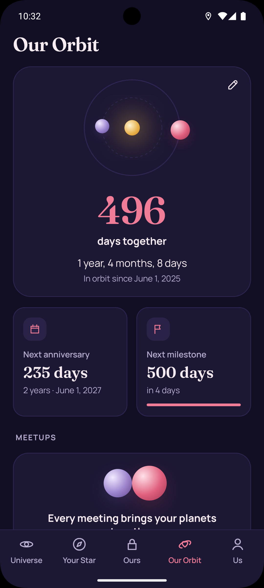
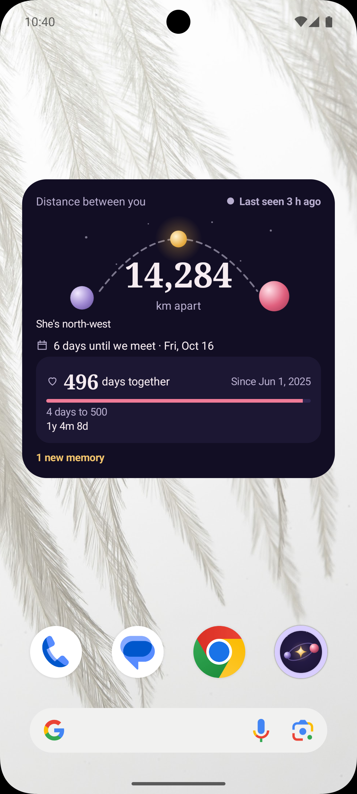

# Twoverse

A private Android app for long-distance couples.


<p>
  
  
  
  
</p>

## Features

- **Live distance**: the distance to your partner, with how recent their location is.
- **Your Star**: a compass that points toward your partner.
- **Until We Meet**: a shared countdown to the next reunion.
- **Ours**: a private photo vault with optional expiry, screenshot blocking and a biometric lock.
- **Shooting Stars**: surprise messages your partner sees once, now or at a chosen time.
- **Our Orbit**: days together, milestones and the history of your meetups.
- **Widget**: a home-screen widget in small, medium and large sizes.

## Tech stack

| Area | Technology |
|---|---|
| App | Kotlin 2.4.20, Jetpack Compose (BOM 2026.02.01), Material 3, Hilt 2.60.1, Navigation Compose 2.10.2, Coroutines and StateFlow, Coil 3.6.3, DataStore 1.2.1, WorkManager 2.12.0, Glance 1.2.0 |
| Build | Android Gradle Plugin 9.3.1, Gradle 9.5.0, KSP 2.3.12, compile SDK 37, target SDK 36, min SDK 28 |
| Backend | Supabase (Auth, Postgres 17 with Row Level Security, Storage, Realtime, Edge Functions, pg_cron) via supabase-kt 3.8.0 |
| Sign-in | Google through Credential Manager 1.6.0, and email and password |
| Notifications | Firebase Cloud Messaging (Firebase BoM 34.19.0), sent by the `send-push` Edge Function |

## Architecture

- MVVM with unidirectional data flow. Each screen has a stateless `XScreen`, an `XRoute` that connects it to a Hilt `XViewModel`, and an immutable `XUiState`.
- Features live in their own packages under `feature/` and never import each other. Shared code is in `core/`.
- ViewModels depend on repository interfaces. Supabase implementations are bound with Hilt; fake implementations back previews and unit tests.
- Every table has Row Level Security so users can only read their own couple's data. Multi-step rules such as pairing, disconnecting and deleting an account run as Postgres functions.

Conventions and coding rules are in [CLAUDE.md](CLAUDE.md).


## Getting started

### Prerequisites

- Android Studio with support for Android Gradle Plugin 9.3.1
- JDK 21 for the Gradle daemon (the app compiles to Java 17)
- [Supabase CLI](https://supabase.com/docs/guides/local-development/cli/getting-started)
- Docker, for the local Supabase stack

### Clone

```sh
git clone https://github.com/Keeththi2003/twoverse.git
cd twoverse
```

### Configure the app

Create `android/local.properties` with these keys:

| Key | Description |
|---|---|
| `SUPABASE_URL` | URL of the Supabase project |
| `SUPABASE_PUBLISHABLE_KEY` | The project's publishable key (never the secret or service-role key) |
| `GOOGLE_WEB_CLIENT_ID` | OAuth web client ID used for Google sign-in |

Place the Firebase config file at `android/app/google-services.json`.

### Local Supabase

From the repository root:

```sh
supabase start      # start the local stack (requires Docker)
supabase db reset   # apply all migrations to the local database
supabase stop       # stop the stack
```

The `send-push` Edge Function reads `FIREBASE_SERVICE_ACCOUNT` and `PUSH_INTERNAL_SECRET` from its environment. Scheduled jobs read `project_url`, `push_internal_secret` and `storage_service_key` from Supabase Vault.

## Build and run

From `android/`:

```sh
./gradlew assembleDebug
./gradlew installDebug
```

Or open `android/` in Android Studio and run the `app` configuration.

## Testing

From `android/`:

```sh
./gradlew testDebugUnitTest   # unit tests
./gradlew lint                # Android lint
```

From the repository root, with the local Supabase stack running:

```sh
supabase test db   # pgTAP tests for schema, RLS policies and functions
```

## Release build

Release signing values are read from `android/local.properties`:

| Key | Description |
|---|---|
| `RELEASE_STORE_FILE` | Path to the keystore |
| `RELEASE_STORE_PASSWORD` | Keystore password |
| `RELEASE_KEY_ALIAS` | Key alias |
| `RELEASE_KEY_PASSWORD` | Key password |

```sh
./gradlew assembleRelease
```

Without all four keys the release APK is built unsigned. Release builds are optimized with the rules in `android/app/proguard-rules.pro`.

## Versioning

Twoverse follows [Semantic Versioning](https://semver.org/). Releases are tagged `vMAJOR.MINOR.PATCH`. `versionName` in `android/app/build.gradle.kts` matches the tag, and `versionCode` increases with every release. Changes are recorded in [CHANGELOG.md](CHANGELOG.md).

## Documentation

- [Software requirements](docs/SRS.md)
- [Design spec](docs/design/DESIGN.md)

## Security

Secrets are never committed. These files are ignored by Git:

- `android/local.properties`
- `android/app/google-services.json`
- Keystores under `android/`: `*.jks`, `*.keystore`, `*.p12`
- Environment files under `android/`: `.env`, `.env.*`
- Supabase secrets: `supabase/.env`, `supabase/functions/.env`, `.env.keys`, `.env.local`, `.env.*.local`

The app uses only the Supabase publishable key. The secret key and the Firebase service account exist only as Edge Function secrets.

## License

Proprietary. All rights reserved. See [LICENSE](LICENSE).

## Author

K.Keeththigan
